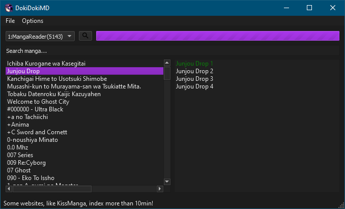
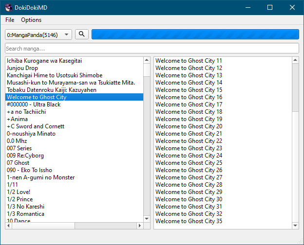

# DokiDokiMD

Python manga downloader.

# Disclaimer
THIS TOOL HAS BEEN RELEASED JUST FOR TESTING PURPOSES.

# What is DDMD?
DokiDoki Manga Downloader is a software that helps you manage and download manga chapters.
 
It is able to convert downloaded images(regardles of orientation) into single pdf file, ready to read.

# What is required?
Python 3.5 or greater.

## Overview
Data downloaded by the program is stored in a files. Each site has its own file (database).
 
Object used by the program are saved and loaded (with [Pickle](https://docs.python.org/3/library/pickle.html)), look into [source](dokidokimd/models.py) to see what is stored.

## Build from source
*Run [script](installer/installer.py) stored in installer folder*

## How to use?
1. Use dropdown menu to select website
2. Click the search(magnifying lens) icon - this will trigger indexing (you can use pre-indexed site files from repo)
    1. Cloudflare websites or some other may be heavy on indexing - look at the size of included sites to figure out which site is easy to index 
3. On the left site, there should be a list of all the manga found on currently selected site.
    1. You can type name(or part of it) in the text box (hinted with "Search manga..." text) - can freeze for a sec if there is a lot of positions
    2. Simply double click on desired manga and available chapters will be indexed (not downloaded)
    3. Checkout other operations available by right mouse click!
4. On the right site, there should be a list of all the chapters in selected manga
    1. Simply double click on desired chapter do download it (it will be stored in memory)
    2. Use right mouse click to discover avaiable options -- you can create PDF without saving images  

> If you choose to save or create PDF without downloading chapter program will queue download for you

Just explore the GUI

  
  

## Issues
To post any issue use available issue templates:
- [BUG](.github/ISSUE_TEMPLATE/bug_report.md)
- [FEATURE](.github/ISSUE_TEMPLATE/feature_request.md)

## [Dependencies](requirements.txt)
- [Selenium](https://github.com/SeleniumHQ/selenium)
- [reportlab](https://pypi.org/project/reportlab/)
- [PyQt5](https://pypi.org/project/PyQt5/)
- [Pillow](https://pypi.org/project/Pillow/)
- [lxml](https://pypi.org/project/lxml/)
- [requests](https://pypi.org/project/requests/)

## License
This project is licensed under the MIT License - see the [LICENSE](LICENSE) file for details
